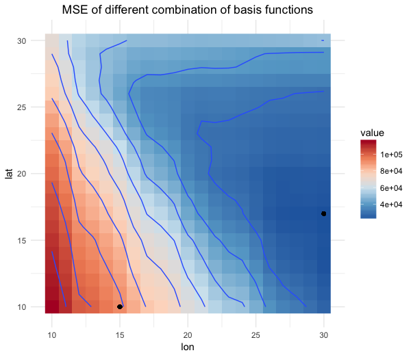
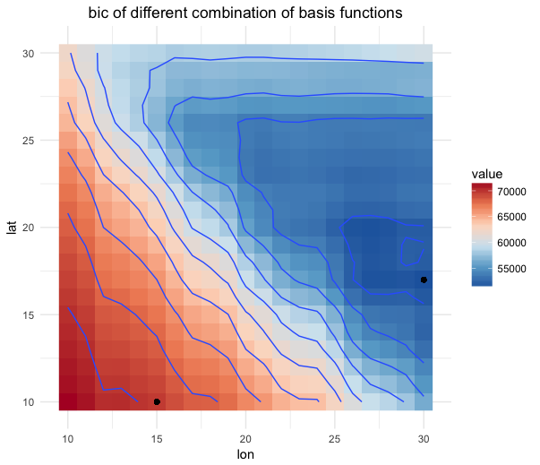
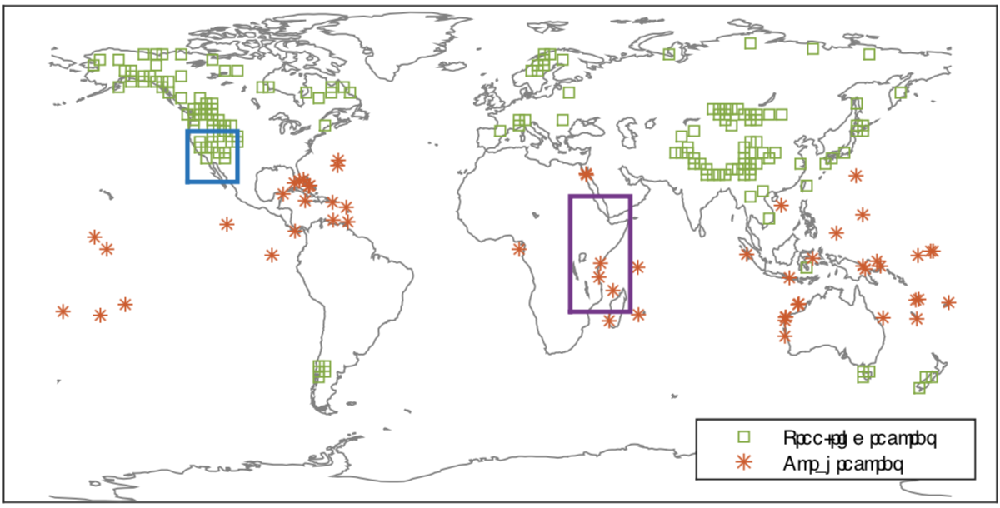

# Last Week
1. Choose number of basis functions to use
2. Visualize differences between the prior and the central regions
3. Switch to new data and check code

# Results
## Basis Functions
I looked at the MSE and the BIC of the approximate field using between 100 to 900 basis functions. 150 (15 x 10) seemed to provide a decently low MSE and BIC for a "low res" approximation of the field. 510 (30 x 17) was used for a "hi res" approximation since this combination minimized the BIC.

{ width=50% } { width=50% }

## Visualization
To visualize the differences between the central regions and the prior I first found how far each coefficient was above or below the 95% central region (being in the central region counted as 0). I then mapped these distances back to a spatial field using the (low res) basis functions to get the following plots.

I plotted the "distance fields" at 3 widely spaced time points that show that:
1. Where the prior differs from the ensemble changes over time
2. How much it differs can change over time

Additionally I suspected that the places where the prior signficantly differed from the ensemble would be around the proxy sites, so I pulled the graph of proxy network from the Smerdon paper. Visually it looks like the prior is most likely to be outside of the 95% central regions near the proxy sites. However, not all proxy sites cause the ensemble and prior to differ significantly.

```{r setup, include=FALSE, cache=TRUE}
rm(list = ls())
gc()

library(extdepth)
library(ncdf4)
library(dplyr)
library(plotly)
library(reshape2)
library(RcppEigen)
# library(RColorBrewer)
# library(fields)

##### CONNECT TO DATA #####
# read ensembles and prior ncdf4 objects
nc.ens = nc_open('/Users/trevh/Research/assimilation-cfr/data/tas_ens_da_hydro_r.1000-2000_d.16-Feb-2018.nc')
nc.prior = nc_open('/Users/trevh/Research/assimilation-cfr/data/tas_prior_da_hydro_r.1000-2000_d.16-Feb-2018.nc')

# get data dim
n.lon = nc.ens$dim$lon$len
n.lat = nc.ens$dim$lat$len
n.ens = nc.ens$dim$sub_ens$len

```


```{r basis, include=FALSE, cache=TRUE}
##### CONSTRUCT THE BASIS FUNCTIONS #####
# incase this gets changed do 10 and 15
nlat.centers = 10
nlon.centers = 15
n.center = nlat.centers * nlon.centers

lats = as.vector(nc.ens$dim$lat$vals)
lons = as.vector(nc.ens$dim$lon$vals)
lats.cen = seq(min(lats), max(lats), length.out = nlat.centers)
lons.cen = seq(min(lons), max(lons), length.out = nlon.centers)

# find the radius (1.5 times the minimal distance)
# will either be the distance b/w the first point and the next (horizontally or vertically)
rad = 1.5 * min(abs(lats.cen[1] - lats.cen[2]), abs(lons.cen[1] - lons.cen[2]))

# CHECK THAT THIS LINES UP WITH X
latlon = as.matrix(expand.grid(1:nlat.centers, 1:nlon.centers))
basis = matrix(0, n.lat*n.lon, n.center)

for (i in 1:n.center) {
  
  # dist = (lat - center.lat)^2 + (lon - center.lon)^2
  dist = c(outer((lats - lats.cen[latlon[i,][1]])^2, (lons - lons.cen[latlon[i,][2]])^2, "+"))
  
  # use the bisquare (radial) basis
  basis[,i] = (1 - dist/rad^2)^2 * (sqrt(dist) < rad)
}
```


```{r, include=FALSE, cache=TRUE}
t = 100

# extract data from the ncdf4 objects
ens = ncvar_get(nc.ens, attributes(nc.ens$var)$names[1], start = c(1, 1, t, 1), count = c(-1, -1, 1, -1))
prior = ncvar_get(nc.prior, attributes(nc.prior$var)$names[1], start = c(1, 1, t), count = c(-1, -1, 1))

# transpose for intuitive (to me) layout
ens = aperm(ens, c(2, 1, 3))
prior = t(prior)

# remove lat means
ens = vapply(1:n.ens, function(x) ens[,,x] - rowMeans(ens[,,x]), FUN.VALUE = matrix(0, nrow = n.lat, ncol = n.lon))
prior = prior - rowMeans(prior)

# normalize
lats = as.vector(nc.ens$dim$lat$vals)
latmat = matrix(rep(lats, n.lon), n.lat, n.lon)
latmat = sqrt(abs(cos(latmat*pi/180)))

ens = vapply(1:n.ens, function(x) ens[,,x]*latmat, FUN.VALUE = matrix(0, nrow = n.lat, ncol = n.lon))
prior = prior * latmat


##### FIT BASIS AND FIND ED #####
prior.alpha = coef(fastLmPure(basis, as.vector(prior)))
ens.alpha = sapply(1:n.ens, function(x) coef(fastLmPure(basis, as.vector(ens[,,x]))))

# calculate extremal depth
ed = sapply(1:ncol(ens.alpha), function(x) edepth(ens.alpha[,x], ens.alpha))
central = central_region(ens.alpha, ed, 0.05)
```


```{r, echo=FALSE, cache=TRUE}
alpha.dev = rep(0, length(prior.alpha))
for (a in 1:length(alpha.dev)) {
  if (central[[1]][a] > prior.alpha[a]) {
    alpha.dev[a] = prior.alpha[a] - central[[1]][a]
  } 
  if (prior.alpha[a] > central[[2]][a]) {
    alpha.dev[a] = prior.alpha[a] - central[[2]][a]
  }
}
prior.vec = basis %*% alpha.dev


# overlay coeff diff field over the earth
# reshape for plotting
rotate <- function(x) t(apply(x, 2, rev))

prior.dev = matrix(prior.vec , n.lat, n.lon)
prior.plot = rotate(prior.dev)
dimnames(prior.plot) = list(lons-180, lats)
prior.gg = melt(prior.plot)
colnames(prior.gg) = c("lon", "lat", "value")
  
# map it
ggplot(prior.gg, aes(lon, lat, z = value, fill = value)) + 
  geom_raster(interpolate = TRUE) +
  geom_contour() +
  borders("world", colour = "grey20") +
  coord_fixed(1.3) +
  scale_fill_distiller(palette = "RdBu", limits = c(-max(abs(prior.plot)), max(abs(prior.plot)))) +
  theme_void() +
  theme(plot.title = element_text(hjust = 0.5)) +
  labs(title = paste0("T = ", t))
```


```{r, include=FALSE, cache=TRUE}
t = 400

# extract data from the ncdf4 objects
ens = ncvar_get(nc.ens, attributes(nc.ens$var)$names[1], start = c(1, 1, t, 1), count = c(-1, -1, 1, -1))
prior = ncvar_get(nc.prior, attributes(nc.prior$var)$names[1], start = c(1, 1, t), count = c(-1, -1, 1))

# transpose for intuitive (to me) layout
ens = aperm(ens, c(2, 1, 3))
prior = t(prior)

# remove lat means
ens = vapply(1:n.ens, function(x) ens[,,x] - rowMeans(ens[,,x]), FUN.VALUE = matrix(0, nrow = n.lat, ncol = n.lon))
prior = prior - rowMeans(prior)

# normalize
lats = as.vector(nc.ens$dim$lat$vals)
latmat = matrix(rep(lats, n.lon), n.lat, n.lon)
latmat = sqrt(abs(cos(latmat*pi/180)))

ens = vapply(1:n.ens, function(x) ens[,,x]*latmat, FUN.VALUE = matrix(0, nrow = n.lat, ncol = n.lon))
prior = prior * latmat


##### FIT BASIS AND FIND ED #####
prior.alpha = coef(fastLmPure(basis, as.vector(prior)))
ens.alpha = sapply(1:n.ens, function(x) coef(fastLmPure(basis, as.vector(ens[,,x]))))

# calculate extremal depth
ed = sapply(1:ncol(ens.alpha), function(x) edepth(ens.alpha[,x], ens.alpha))
central = central_region(ens.alpha, ed, 0.05)
```


```{r, echo=FALSE, cache=TRUE}
alpha.dev = rep(0, length(prior.alpha))
for (a in 1:length(alpha.dev)) {
  if (central[[1]][a] > prior.alpha[a]) {
    alpha.dev[a] = prior.alpha[a] - central[[1]][a]
  } 
  if (prior.alpha[a] > central[[2]][a]) {
    alpha.dev[a] = prior.alpha[a] - central[[2]][a]
  }
}
prior.vec = basis %*% alpha.dev


# overlay coeff diff field over the earth
# reshape for plotting
rotate <- function(x) t(apply(x, 2, rev))

prior.dev = matrix(prior.vec , n.lat, n.lon)
prior.plot = rotate(prior.dev)
dimnames(prior.plot) = list(lons-180, lats)
prior.gg = melt(prior.plot)
colnames(prior.gg) = c("lon", "lat", "value")
  
# map it
ggplot(prior.gg, aes(lon, lat, z = value, fill = value)) + 
  geom_raster(interpolate = TRUE) +
  geom_contour() +
  borders("world", colour = "grey20") +
  coord_fixed(1.3) +
  scale_fill_distiller(palette = "RdBu", limits = c(-max(abs(prior.plot)), max(abs(prior.plot)))) +
  theme_void() +
  theme(plot.title = element_text(hjust = 0.5)) +
  labs(title = paste0("T = ", t))
```


```{r, include=FALSE, cache=TRUE}
t = 800

# extract data from the ncdf4 objects
ens = ncvar_get(nc.ens, attributes(nc.ens$var)$names[1], start = c(1, 1, t, 1), count = c(-1, -1, 1, -1))
prior = ncvar_get(nc.prior, attributes(nc.prior$var)$names[1], start = c(1, 1, t), count = c(-1, -1, 1))

# transpose for intuitive (to me) layout
ens = aperm(ens, c(2, 1, 3))
prior = t(prior)

# remove lat means
ens = vapply(1:n.ens, function(x) ens[,,x] - rowMeans(ens[,,x]), FUN.VALUE = matrix(0, nrow = n.lat, ncol = n.lon))
prior = prior - rowMeans(prior)

# normalize
lats = as.vector(nc.ens$dim$lat$vals)
latmat = matrix(rep(lats, n.lon), n.lat, n.lon)
latmat = sqrt(abs(cos(latmat*pi/180)))

ens = vapply(1:n.ens, function(x) ens[,,x]*latmat, FUN.VALUE = matrix(0, nrow = n.lat, ncol = n.lon))
prior = prior * latmat


##### FIT BASIS AND FIND ED #####
prior.alpha = coef(fastLmPure(basis, as.vector(prior)))
ens.alpha = sapply(1:n.ens, function(x) coef(fastLmPure(basis, as.vector(ens[,,x]))))

# calculate extremal depth
ed = sapply(1:ncol(ens.alpha), function(x) edepth(ens.alpha[,x], ens.alpha))
central = central_region(ens.alpha, ed, 0.05)
```


```{r, echo=FALSE, cache=TRUE}
alpha.dev = rep(0, length(prior.alpha))
for (a in 1:length(alpha.dev)) {
  if (central[[1]][a] > prior.alpha[a]) {
    alpha.dev[a] = prior.alpha[a] - central[[1]][a]
  } 
  if (prior.alpha[a] > central[[2]][a]) {
    alpha.dev[a] = prior.alpha[a] - central[[2]][a]
  }
}
prior.vec = basis %*% alpha.dev


# overlay coeff diff field over the earth
# reshape for plotting
rotate <- function(x) t(apply(x, 2, rev))

prior.dev = matrix(prior.vec , n.lat, n.lon)
prior.plot = rotate(prior.dev)
dimnames(prior.plot) = list(lons-180, lats)
prior.gg = melt(prior.plot)
colnames(prior.gg) = c("lon", "lat", "value")
  
# map it
ggplot(prior.gg, aes(lon, lat, z = value, fill = value)) + 
  geom_raster(interpolate = TRUE) +
  geom_contour() +
  borders("world", colour = "grey20") +
  coord_fixed(1.3) +
  scale_fill_distiller(palette = "RdBu", limits = c(-max(abs(prior.plot)), max(abs(prior.plot)))) +
  theme_void() +
  theme(plot.title = element_text(hjust = 0.5)) +
  labs(title = paste0("T = ", t))
```




# Issues
1. The world map and the heatmap might be misaligned. Russia clips a little and antarctica appears to be shifted north. Setting the xlim and ylim doesn't seem to work and deletes countries from the map...
2. It would be nice if I could add the proxy locations into my graphs
3. More basis functions = much slower run times. Not a problem now when I'm just inspecting 5-10 time points but could be a problem later if I need to run all 998 times.

# Next Week
1. Fix the graphs. Clean up and optimize code.
2. Implement outlier detection from the paper and see how results differ vs 95% central regions
3. Meet with collaborators. Find out whats interesting to pursue from here.
4. Anything else?
5. (Maybe) Talk to Naveen again about quanitifying differences between the fields